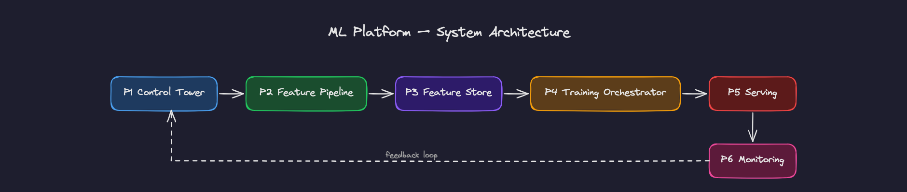

# ML Platform for Real-Time Decisioning

Production-grade ML platform designed for real-time decisioning systems.

This repository is the entry point to a multi-repo system that covers the full lifecycle of machine learning in production: from real-time data ingestion to feature computation, feature serving, model training, low-latency inference, and operational monitoring.

## System overview

The platform is structured as a set of interoperable layers:

**P1 → P2 → P3 → P4 → P5 → P6 → P7**

P6 observes artifacts from P2, P4, and P5 to produce lineage, freshness, and health signals. P7 consumes P5 predictions and P6 health state to emit deterministic action decisions, closing the operational loop.

| Layer | Component | Responsibility |
|-------|-----------|----------------|
| P1 | `urban-mobility-control-tower` | Real-time data ingestion, CDC, streaming aggregation (`raw_station_metrics_1min`), analytical surface |
| P2 | `mobility-feature-pipeline` | Point-in-time feature engineering, supervised dataset generation |
| P3 | `mobility-feature-store` | Feature storage, point-in-time retrieval, offline/online serving consistency |
| P4 | `ml-training-orchestrator` | Reproducible training, evaluation, experiment tracking, inference bundle packaging |
| P5 | `mobility-serving-layer` | Real-time inference with point-in-time feature reconstruction from upstream raw metrics DB, schema-driven training/serving parity, serving observability artifacts, P7 decisioning integration |
| P6 | `monitoring-feedback-layer` | Per-deployment health classification, dataset/model lineage, freshness and staleness detection (observes P2, P4, P5) |
| P7 | `mobility-decision-engine` | Deterministic decision layer: consumes P5 predictions and P6 health signals, emits action decisions |

Each repository represents a system boundary with explicit contracts between layers.

## Architecture

End-to-end system flow:

### Ingestion (P1)
GBFS → Postgres → Debezium CDC → Kafka → Flink → DuckDB

### Feature computation (P2)
SQL-based feature engineering with strict temporal constraints and point-in-time correctness.

### Feature storage (P3)
Parquet datasets, offline/online retrieval paths, and point-in-time lookup semantics.

### Model training (P4)
Time-based splits, reproducible training runs, evaluation, experiment tracking, and model packaging.

### Serving (P5)
Real-time inference with point-in-time feature reconstruction from the upstream raw metrics DB (`raw_station_metrics_1min`). Training/serving parity is enforced via schema-driven contracts against the same feature definitions used in P2. Emits structured deployment events and 60-second metrics windows as append-only serving observability artifacts. Calls P7 for deterministic decisioning on each prediction cycle.

### Monitoring and feedback (P6)
Observes metadata artifacts from P2 (dataset builds), P4 (training runs), and P5 (serving metrics). Computes deterministic per-deployment health classification across three states (healthy, degraded, unhealthy). Health evaluation accounts for staleness, window gaps, missing windows, latency, and error rates. Maintains dataset-to-model lineage, freshness tracking, and validation signals.

### Decision engine (P7)
Consumes P5 predictions and P6 health signals. Emits deterministic action decisions (e.g., rebalancing dispatch) gated on prediction confidence and deployment health state. Closes the operational loop by converting ML outputs into system actions.

## Completion status

P1 through P7 are implemented and integrated across repos. Serving metrics flow from P5 into P6, where per-deployment health is computed deterministically against configurable thresholds. Lineage traces datasets through training to serving. P7 consumes P5 predictions and P6 health signals to emit deterministic action decisions, closing the operational loop. Dashboards, alerting infrastructure, and automated retraining triggers are intentionally deferred as separate concerns outside this platform slice.

## System properties

- Strict separation of concerns across layers
- Explicit contracts between ingestion, features, training, serving, and monitoring
- Deterministic feature definitions between training and serving
- No feature recomputation outside the feature pipeline
- Point-in-time correctness across the full system
- Reproducible training datasets and model runs
- Stateless, horizontally scalable serving layer
- Operational observability tied to actual ML artifacts and contracts
- Clear path toward closed-loop retraining and deterministic action decisions

## How to explore

Start with this README to understand the overall system architecture and the role of each layer. Then inspect individual repos in any order — each is independently understandable with its own README, contracts, and test suite. Cloning all repos is not required; the portfolio README and individual repo READMEs are designed to be read on GitHub.

For the data flow, follow the layer order: P1 (ingestion) → P2 (features) → P3 (store) → P4 (training) → P5 (serving) → P6 (monitoring) → P7 (decisions).

## Design approach

This platform is built as a system, not a collection of projects.

Each layer is:

- independently understandable
- contract-driven
- composable with the rest of the stack
- scoped to a single operational responsibility

The objective is not only model performance. The system is designed around reliability, reproducibility, temporal correctness, and production-grade interfaces between layers.

## Current implementation

The current implementation is demonstrated through an urban mobility use case focused on bike station availability prediction.

The architectural pattern is platform-level and reusable beyond mobility. The same layer model can be extended to other operational decisioning domains such as retail, logistics, fulfillment, and marketplace systems.

## Repository links

- **P1** — `urban-mobility-control-tower`  
  https://github.com/scaleborg/urban-mobility-control-tower

- **P2** — `mobility-feature-pipeline`  
  https://github.com/scaleborg/mobility-feature-pipeline

- **P3** — `mobility-feature-store`  
  https://github.com/scaleborg/mobility-feature-store

- **P4** — `ml-training-orchestrator`  
  https://github.com/scaleborg/ml-training-orchestrator

- **P5** — `mobility-serving-layer`  
  https://github.com/scaleborg/mobility-serving-layer

- **P6** — `monitoring-feedback-layer`  
  https://github.com/scaleborg/monitoring-feedback-layer

- **P7** — `mobility-decision-engine`  
  https://github.com/scaleborg/mobility-decision-engine
